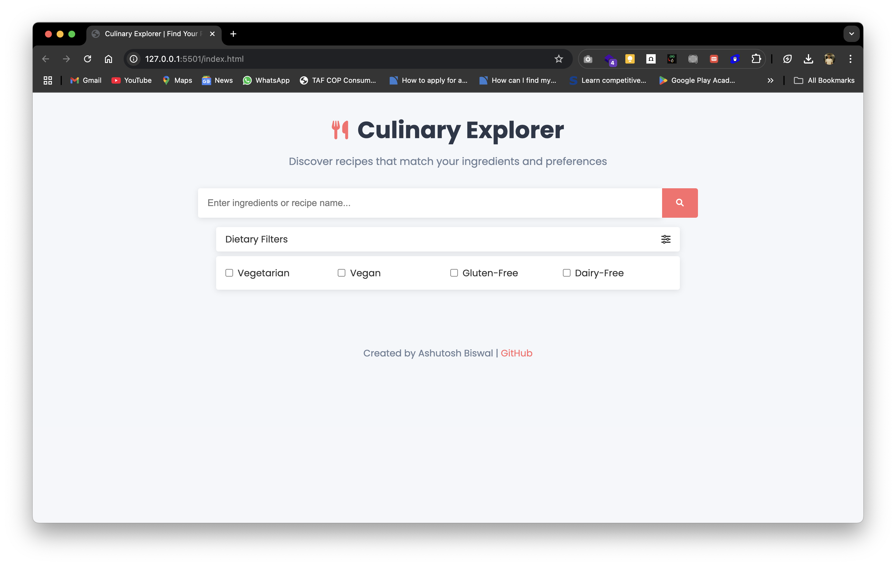
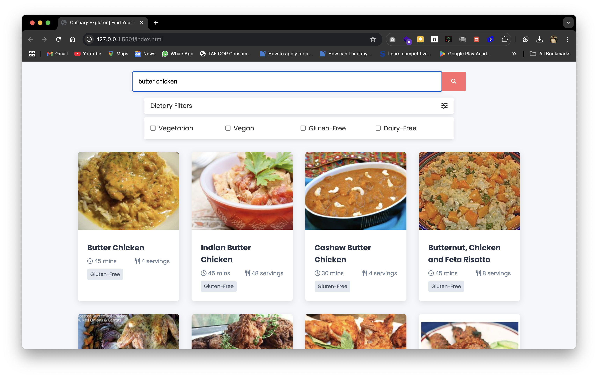
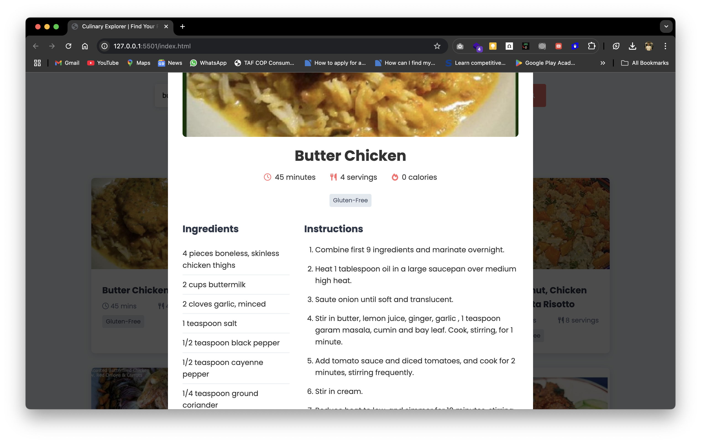

# recipe-explorer
This project demonstrates the use of API in finding food recipes.
# Culinary Explorer - Recipe Finder


## 🍽️ Overview

Culinary Explorer is a responsive web application that helps users discover recipes based on ingredients they have or dishes they want to make. This app uses the Spoonacular API to provide a rich database of recipes with detailed information, ingredients, and instructions.

## ✨ Features

- **Intuitive Recipe Search** - Find recipes by ingredients or dish names
- **Dietary Filters** - Filter results by vegetarian, vegan, gluten-free, and dairy-free options
- **Detailed Recipe View** - Get comprehensive information including ingredients, instructions, cooking time, and nutritional highlights
- **Responsive Design** - Fully functional on all devices from mobile to desktop
- **Modern UI** - Clean, attractive interface with smooth animations and transitions

## 🛠️ Technologies Used

- HTML5
- CSS3 (Flexbox & Grid for layouts)
- JavaScript (ES6+)
- Spoonacular API for recipe data
- Font Awesome for icons
- Google Fonts

## 📱 Screenshots


*Home page with search interface and filters*


*Recipe search results displayed as cards*


*Detailed recipe view with ingredients and instructions*

## 🚀 Live Demo

Check out the live application: [Culinary Explorer](https://recipe-explorer-two.vercel.app/)

## 🔧 Setup and Installation

### Prerequisites
- A Spoonacular API key (get one for free at [Spoonacular API](https://spoonacular.com/food-api/console#Dashboard))

### Local Development
1. Clone this repository:
   ```bash
   git clone https://github.com/yourusername/recipe-finder.git
   cd recipe-finder
   ```

2. Open `script.js` and replace the placeholder API key:
   ```javascript
   const API_KEY = 'YOUR_SPOONACULAR_API_KEY';
   ```

3. Open `index.html` in your browser to run the application locally

### Deployment
The project is deployed using GitHub Pages. Any changes pushed to the main branch will be automatically deployed.

## 🌟 Future Enhancements

- User accounts to save favorite recipes
- Meal planning calendar
- Shopping list generator based on selected recipes
- Dark mode toggle
- Recipe rating and reviews

## 💡 Key Learning Outcomes

- Implementing a responsive design using modern CSS techniques
- Working with third-party APIs and handling asynchronous requests
- Creating an intuitive user interface with filtering capabilities
- Building modals and complex layouts
- Error handling and loading states for better user experience

## 👨‍💻 About the Developer

I'm a passionate front-end developer focused on creating intuitive and responsive web applications. This project demonstrates my ability to create a fully functional application using vanilla JavaScript without relying on frameworks.

## 📄 License

This project is open source and available under the [MIT License](LICENSE).

---

## Acknowledgements

- Recipe data provided by [Spoonacular API](https://spoonacular.com/food-api)
- Icons from [Font Awesome](https://fontawesome.com)
- Fonts from [Google Fonts](https://fonts.google.com)
